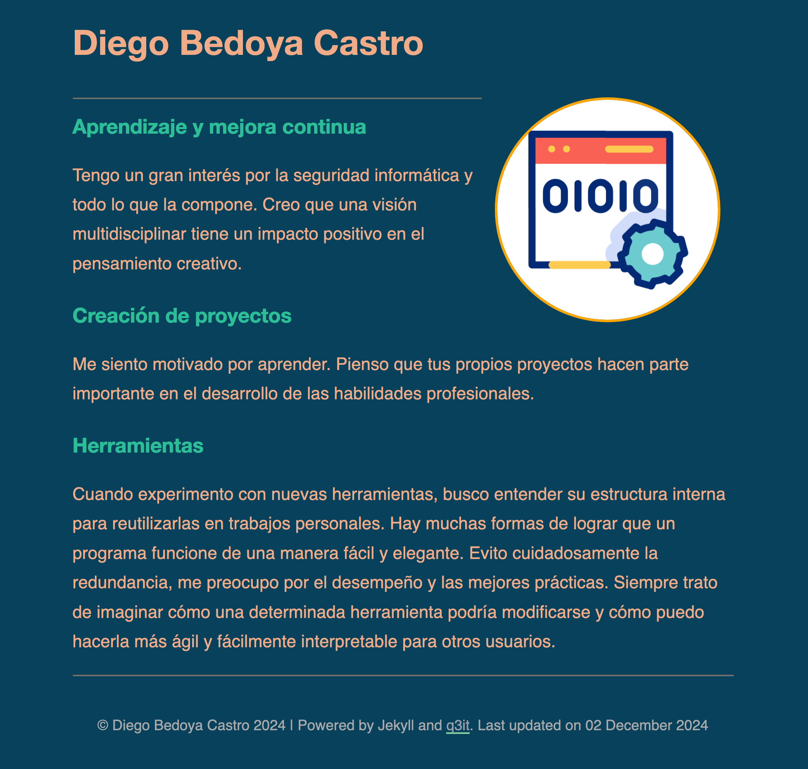

# Card

Responsive, dark-mode ready Jekyll theme designed for use as a personal website.

## Features
- Responsive.
- Dark Mode preference.
- Page for presentations.

## Documentation

Check out the [Wiki](https://github.com/q3it/card/wiki) for some tips on [publishing to a custom domain](https://github.com/q3it/card/wiki/Publishing-your-website) or an [indicative list of things to customise before you publish](https://github.com/q3it/card/wiki/Customising-your-website) 
